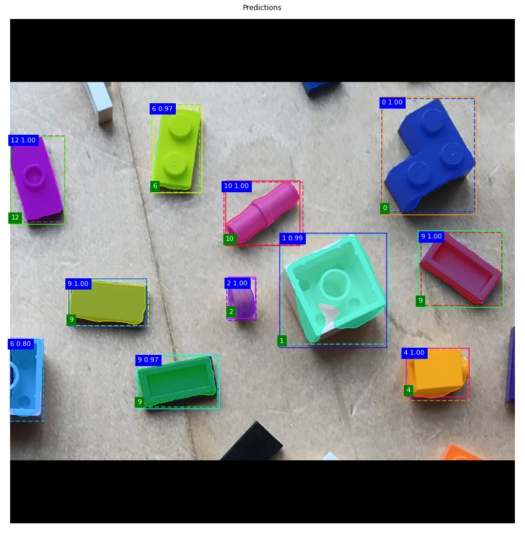
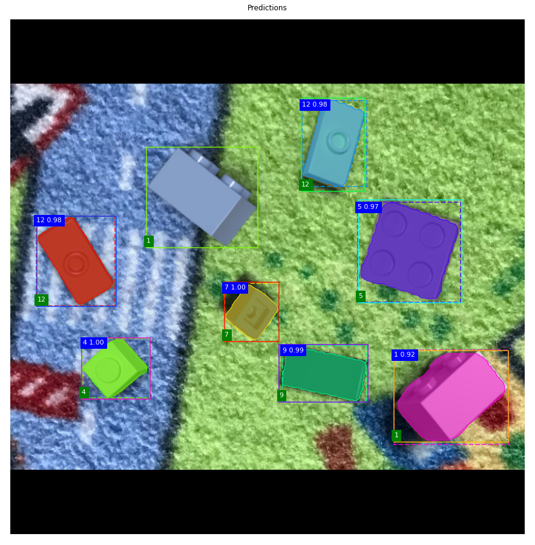
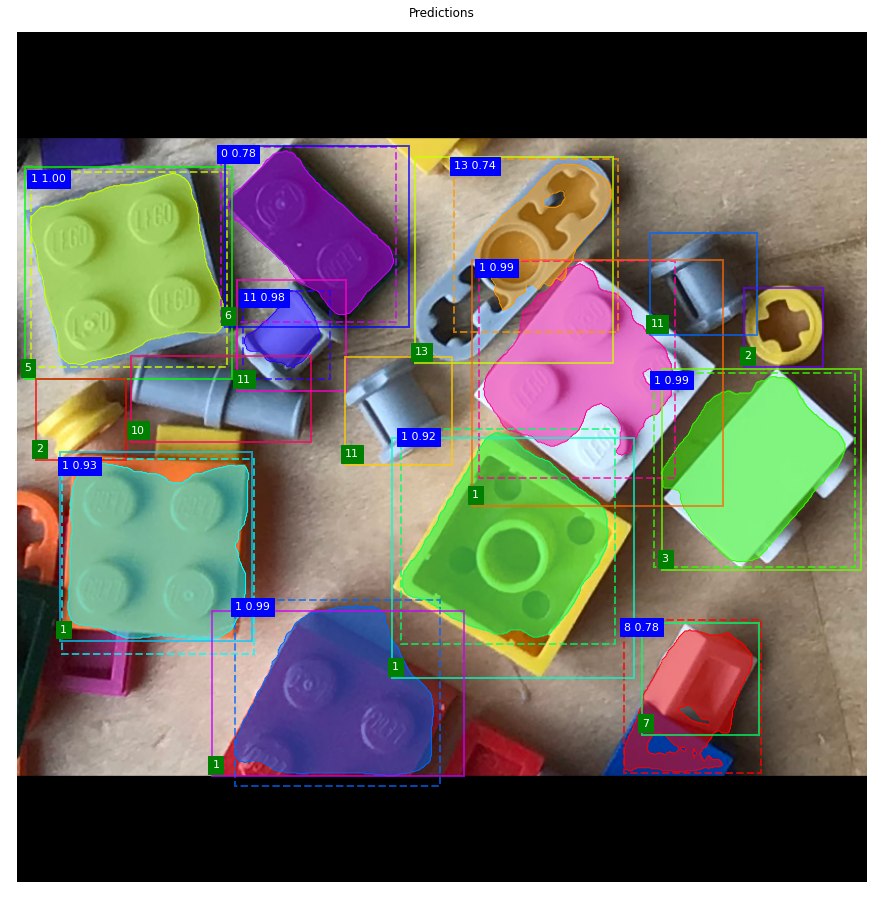

# Convolutional Neural Network to detect LEGO Bricks
Detect LEGO bricks with Mask R-CNN using synthetical images for training.

## Project Goal

The goal of this project is to correctly classify 14 different types of LEGO bricks in an image with an accuracy of better than 95% mAP. This is an object detection task. Each image cotnains multiple LEGO bricks - up to 22 per image. The neural network is trained on *synthetical* LEGO images generated by Blender. The detection on the other hand is on real LEGO images taken by a camera. 

The project uses a Mask R-CNN network architecture and is based on the following project [Mask R-CNN](https://github.com/matterport/Mask_RCNN). Other network architectures have been tested, such as Retinanet. The architecture has been extended with LSTM layers as well. However, the results are similar to the bare Mask R-CNN network architecture.

## Project Status

The first stage of the project has been finished:
 
- The CNN can detect the LEGO's in a real image to an accuracy of up to 74% mAP.
- This first result is quite satisfactory, considering that the network was trained on synthetic image data only.
- The detection of LEGO's in a synthetic image is reliable and equal to validation losses.

This is an example of detecting LEGO's in a real image:

The numbers with the blue background are the classifier id and probability of the prediction. The number with the green background is the classifier id ground truth. The next image is an example of detecting LEGO's in a synthetic image, the same type of images the network was trained for:

## Key Challenge

The key challenge is, that the CNN cannot detect neighboring LEGO's on an image very reliably.

- Trying to modify the dataset, augmentation, architecture, or training process did not help to solve the bad detection accuracy.
- The RPN network has particularly difficulties to locate a LEGO on the image, if LEGO's are close to each other.
- First analysis indicates that the neural network (RPN) cannot detect global spatial dependencies well, but instead focuses on local patterns causing large ROIS misalignments.

This is an example of how the detection looks like on an image with neighboring LEGO's: 

It can be seen, that the region of interest boxes (ROIS) are not well predicted on some LEGO's by the RPN. This makes it more difficult for the classification and segmentation networks to predict the LEGO id correctly. Typically, in a CNN the network builds up more abstract representations of the object as deeper the layers go. However, from the analysis of the detection results, it appears the network focuses too much on local patterns instead. It cannot recognize larger spatial dependencies. Other projects have been addressing this issue by combining CNN with RNN. See:

[“Convolutional Recurrent Neural Networks: Learning Spatial Dependencies for Image Representation.”](http://www.google.com/url?q=http%3A%2F%2Fwww.cv-foundation.org%2Fopenaccess%2Fcontent_cvpr_workshops_2015%2FW03%2Fpapers%2FZuo_Convolutional_Recurrent_Neural_2015_CVPR_paper.pdf&sa=D&sntz=1&usg=AFQjCNGhHjUKRVuE5aMg1t71GllfHG0alA)

[“CNN-RNN: a large-scale hierarchical image classification framework”](https://link.springer.com/article/10.1007/s11042-017-5443-x)

[“Learning Contextual Dependencies with Convolutional Hierarchical Recurrent Neural Networks”](https://arxiv.org/pdf/1509.03877.pdf)

I was able to integrate an LSTM network into the Mask R-CNN classifier network. However, extending the RPN network with LSTM layers will increase the overall network parameters and require an enormous amount of memory. Hence, the hardware is the limiting factor. I have posted this project, to find interested machine learning enthusiasts, who are willing to continue the work and solve the current challenge about neighboring LEGO's. Maybe you have another idea to overcome the current issues. Please let me know if you are interested or have questions.

## Project Structure

This project is based on the Balloon example provided with Mask R-CNN project. Hence, the folder and data organization is the same. If you are new to this type of projects, please have a look here   [Balloon](https://github.com/matterport/Mask_RCNN/tree/master/samples/balloon) to get started. The project requires TensorFlow 1.x.

## Data

There are two datasets that you can use. All datasets contain 1280 training images and 256 validation images. Each data set has the same 8 test images (eval folder). All images are of size 800x600px.The datasets differ in the following way:

- Dataset6 contains approximately 9 LEGO's per image which results in 11520 LEGO's for training. All LEGO's are *not adjacent*.

- Dataset22 contains approximately 22 LEGO's per image which results in 28160 LEGO's for training. All LEGO's are *adjacent*.

Both datasets are in a zip archive and stored separately on a Google Drive. Once you open and run the Colab Notebook, you can run the first code to copy the datasets over to your own Google Drive. Afterwards make sure the folder structure is as following:

`../datasets/lego/train`

`../datasets/lego/val`

`../datasets/lego/eval`

## Run on Colab

This is the easiest way to run this project.

1. Open a web browser, go to your Google Drive.
2. Copy the entire Github project to your own top-level Google drive.
3. Double-click on the **train_lego_on_colab_github.ipynb** notebook.
4. Click on **Open with Google Colaboratory** to open the notebook in Colab.
5. Make sure to connect your Google Drive to Colab. This is a button on the left top side.
6. You might need to adjust the paths in the notebook **/content/drive/My Drive/lego-cnn** to your setup.
7. Run the notebook

Please note that training on Colab is not working at the moment. There is a bug, probably related to some changes in the Colab package versions. It will be fixed shortly, until then please run on your local machine. 

## Run on Local Machine

To run on your local machine is a bit trickier. This project requires TensorFlow 1.x. You need to use the *reqirements.txt* file to install the correct versions of the packages. This is critical. If you use Anaconda, make sure to install the correct Python environment first through the Anaconda terminal:
  
`conda create --name maskrcnn python=3.5.5
conda activate maskrcnn
conda install GraphViz`

GraphViz is required if you want to plot the model graph. Then install the rest of the packages with pip:

`pip install -r requirements.txt`

If you train locally make sure you run on GPU with enough memory. Nevertheless, it is often of advantage to just start the training locally using a CPU, to check, if the configuration is correct and if there is no error, before running it on Colab or Kaggle. To do this, you can use the following python file:

`python train_lego_locally.py`

Uncomment or comment the individual lines to call the main function (tmain) with the different options.

## Evaluation

If you run on Colab, the **train_lego_on_colab_github.ipynb** notebook contains already a section to analyze the RPN and a section to run the evaluation (inference). This is the best starting point. If this runs, your all set. In the 

`../samples/lego`

folder you can find additional notebooks, that go into more detail. Some are to inspect the network, such as visualization for the feature maps. Others for inference purposes or checking the datasets.

Have fun!

